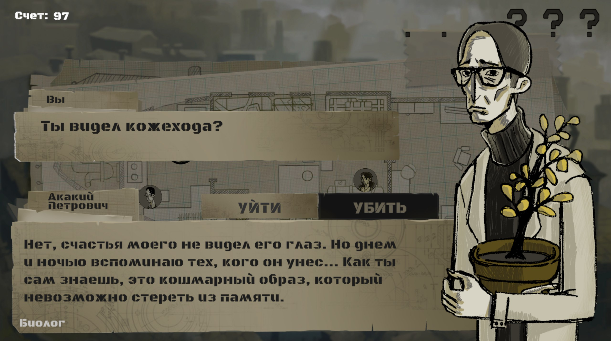
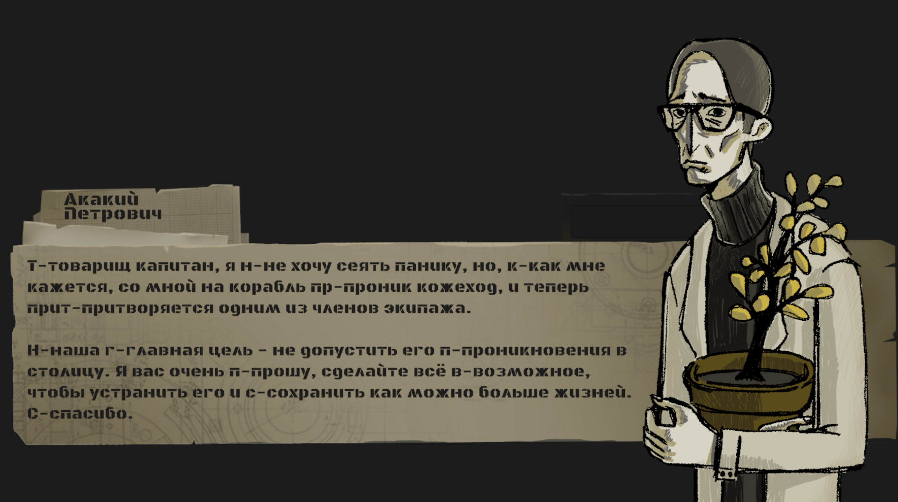
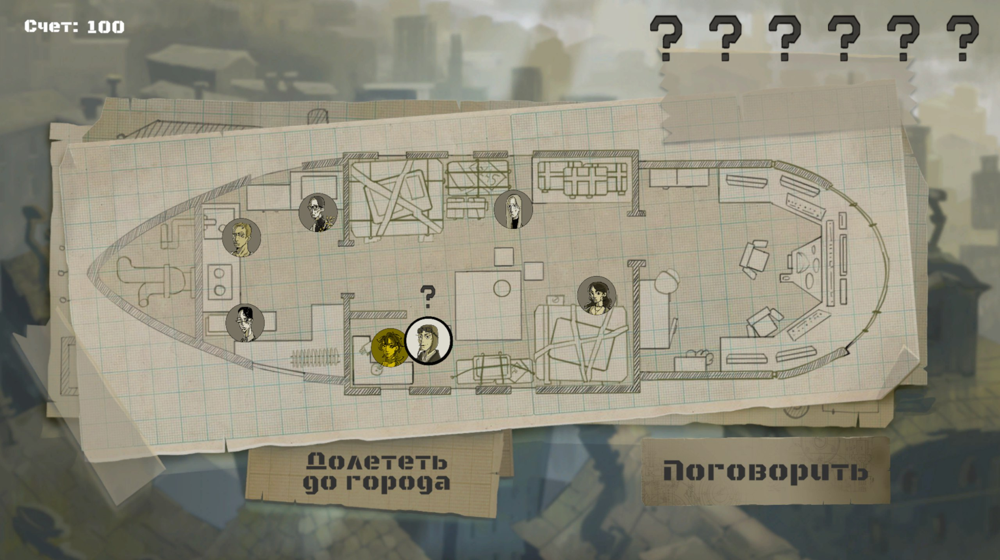
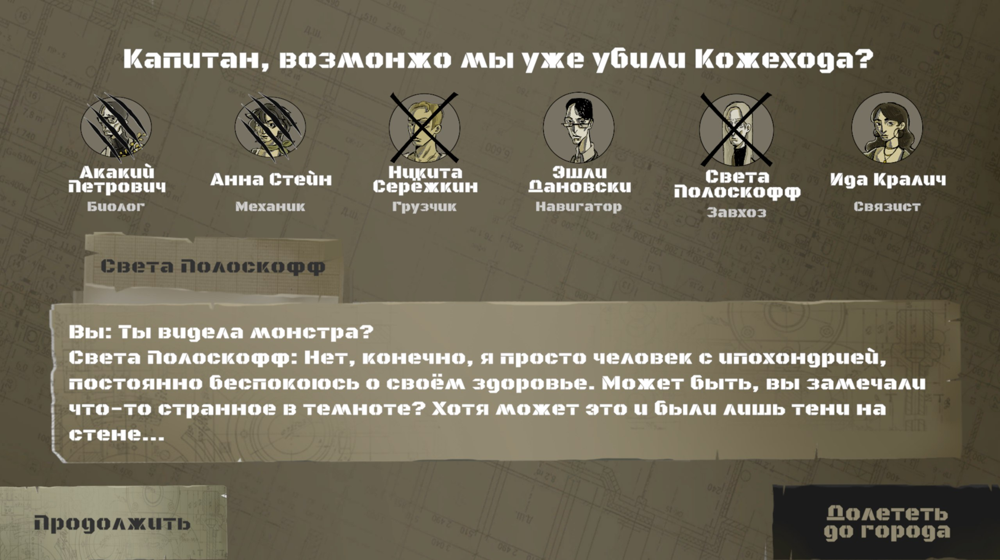
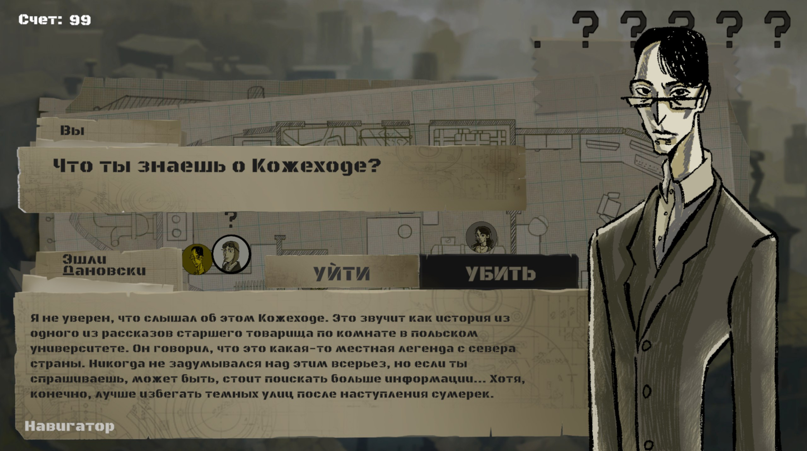
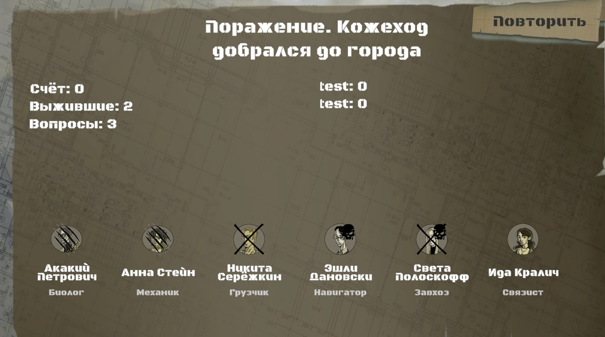

# Твой ход, кожеход

Визуальная новелла в жанре road movie о поиске убийцы на дирижабле.

[](Docs/trailer.MOV)

## Концепция игры.

<!--  -->

Игрок играет за капитана дирижабля, который перевозит шесть персонажей. Среди них есть один кожеход – монстр, который убивает человека и надевает его кожу, маскируясь под свою жертву.

Цель игры – выявить и убить кожехода до того, как дирижабль приедет в конечную точку. Игрок выбирает кого убивать, и если уверен, что выявил кожехода, то может выбрать доехать сразу до финальной точки, не убивая больше никого. До самого конца игрок не будет знать, правильно ли определил монстра.

Особенность игры – встроенная нейросеть Qwen, которая генерирует ответы персонажей исходя из реплик игрока. Это дает возможность общаться с каждым персонажем в произвольном порядке, игрок получает возможность каждый раз проходить игру по-новому.

Жанр игры - визуальная новелла с элементами детектива.

Аудитория игры - пользователи от 15 лет. Интересы аудитории - детективы, групповые игры в жанре мафия, социальные игры.

Подробное описание см. в [гейм-дизайн документе](Docs/GDD.pdf).

## Демо

[](Docs/trailer.MOV)




<!--  -->





## Установка и запуск

### Требования

- Unity 6000.1.8f1
- Ollama

### Шаги по установке

**Установка большой языковой модели**

1. Скачать и установить Ollama: https://ollama.com/download
2. Через Ollama загрузить языковую модель (`ollama pull <model_name>`). Выбор конкретной модели зависит от технических характеристик Вашего компьютера. Ниже список моделей, которые тестировались, можете выбрать одну из них:

- qwen2.5:7b (Скорость приемлема, иногда тупит)
- qwen3:4b (Скорость приемлемая, отвечает хорошо, иногда переходит на английский)
- qwen3:8b (Очень хорошо работает на мощной машине)

**Запуск проекта Unity**

1. Склонируйте репозиторий

```
git clone https://github.com/maks2199/Kozhehod.git
```

2. Откройте проект через Unity Hub.
3. Откройте сцену Main.
4. Выберите в Hierarchy объект GameManager и в Инспекторе, в поле LLM Model Name, укажите выбранную и скаченную через Ollama большую языковую модель.
5. Нажмите Play для запуска.

## Технологии

- Unity 6000.1.8f1
- C#
- Spine

## План развития

- Подключить и использовать пакет для встраивания LLM без Ollama: https://assetstore.unity.com/packages/tools/generative-ai/local-llms-made-easy-320296

## Авторы

Проект сделан в рамках мастерской [GameDev](https://www.letnyayashkola.org/gamedev/) [Летней Школы](https://www.letnyayashkola.org/) в Июле 2025 года.

Команда:

- Аверьянова Сигрун - Лид геймдизайнер !!Контакты
- Платон Ионов - Геймдизайнер;
- Тачков Максим (tachkov.maksim@gmail.com) - Разработчик.

Художники и аниматоры

- Татьяна Донцова - Интерфейс, фон и карта;
- Ульяна Завгородняя - Персонажи;
- Таисия Жабина - Анимация главного меню.

## Благодарности

Спасибо мастерской Gamedev за предоставленную возможность работы над интересным проектом, в частности,

Кураторам:

- Александр Колодочка;
- Антон
- Всеволод Меренков;
- Таисия Жабина.

Лекторам:

- Арганат Денис;
- Беспалов Иван;
- Боровская Ася;
- Кособоков Евгений;
- Кравцов Ярослав;
- Неклюдов Дмитрий.

Спасибо всем участникам за комфортную рабочую атмосферу, классные идеи и тестирование прототипа игры.

## Контакты
